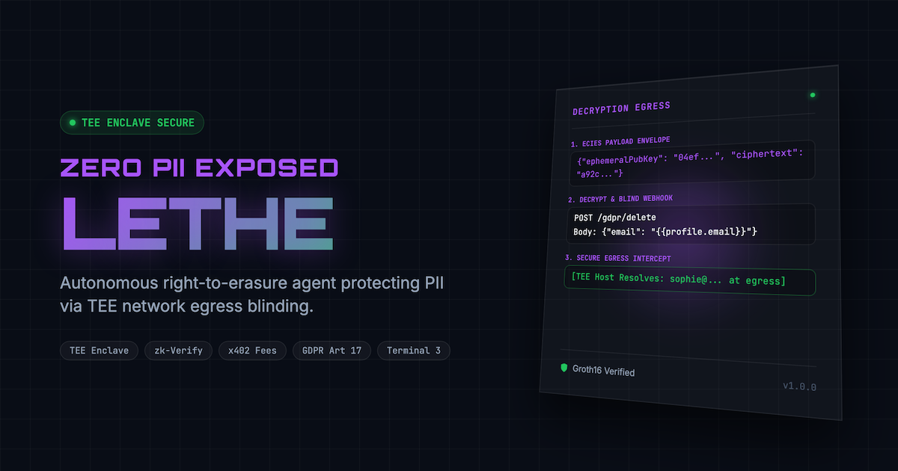
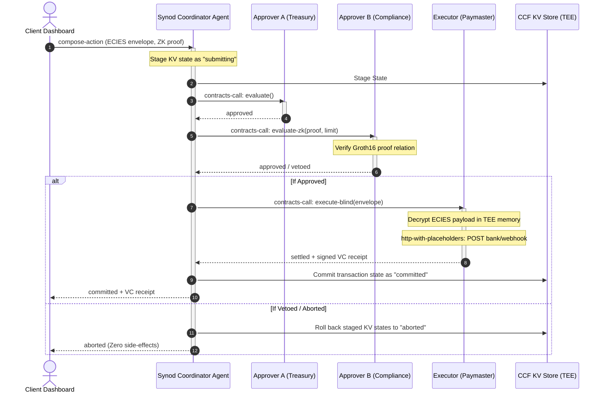

<div align="center">

  
  <h1>Synod 🏛️</h1>
  <p><em>Atomic, multi-agent transactional orchestration engine built inside secure enclaves with 100% cryptographic rollback guarantees.</em></p>
  

  <br/>

  [](https://synod.edycu.dev)
  [](https://youtu.be/W8eQA6kZUAw)
  [](https://synod.edycu.dev/pitch.html)
  [](https://dorahacks.io/hackathon/t3adk-launch-2026)

  <br/>

  
  
  
  
  
  
  
  
  
  [](https://github.com/edycutjong/synod/actions/workflows/ci.yml)
  [](https://www.npmjs.com/package/@edycutjong/synod-sdk)

</div>

---

> ⚡ **Reviewers / judges:** fastest path is **[GOLDEN_PATH.md](GOLDEN_PATH.md)** — the entire flow in ~2 minutes, **no credentials**. Bug-bounty track: **[SDK_AUDIT.md](SDK_AUDIT.md)** (confirmed, code-cited findings from the real `@terminal3` SDK).

## 📸 See it in Action

<div align="center">
  
</div>

> **Atomically orchestrated multi-agent transaction:**
> 1. Client submits payout envelope encrypted via ECIES and a Groth16 limit proof.
> 2. Coordinator stages CCF KV states and evaluates specialists sequentially (Treasury and Compliance).
> 3. If either agent vetos or fails, TEE state rolls back with zero side-effects. On success, the Blind Paymaster executes the payout.

---

## 💡 The Problem & Solution

### The Problem
In enterprise treasury operations, a single agent should never have unilateral authority to release funds. Traditional Web2 agent frameworks (like LangChain or crewAI) orchestrate multi-agent actions sequentially over HTTP. 

If Agent B (Compliance) vetoes a transaction *after* Agent A (Treasury) has already committed its database write or triggered an intermediate API request, the system is left in a broken, half-executed state. Resolving these race conditions requires complex distributed transaction coordinators (e.g. the Saga pattern), which cannot guarantee hardware-isolated privacy or prevent front-running.

### The Solution
**Synod** turns independent agents into a unified, transactional agent platform. By leveraging the **Terminal 3 Agent Dev Kit (ADK)** inside secure TEE enclaves, Synod runs cross-contract workflows under a single atomic transaction boundary.

Either every agent approves and the final blind paymaster executes, or the entire transaction aborts—rolling back all staged states inside the TEE KV store with zero side effects. Privacy is guaranteed: no intermediate agent, not even the coordinator, can view the plaintext payment credentials.

**Key Features:**
- 🔒 **TEE Secure Boundary:** Executes multi-agent sequence inside Intel TDX enclaves ensuring hardware-isolated privacy.
- ⚡ **Atomic Rollback Journal:** Automatically reverts all staged CCF KV writes and aborts egress webhooks on veto/outage.
- 🔑 **ECIES Envelope Encryption:** Client-side payload encryption ensures only the final Executor Agent can decrypt recipient details inside secure memory.
- 🛡️ **ZK Compliance Proofs:** Groth16 zero-knowledge proofs verify payout limits without exposing transaction amounts in audit logs.

---

## 🏗️ Architecture & Tech Stack

| Layer | Component / Technology |
|---|---|
| **Frontend Console** | Next.js 14, React 18, Tailwind CSS |
| **Client SDK** | `@edycutjong/synod-sdk` (ECIES payload encryption, ZK commitments generation) |
| **TEE Contracts** | Rust WASM (`wasm32-wasip2`), Cargo Workspace (`coordinator`, `approver-a`, `approver-b`, `executor`) |
| **State Storage** | File-based JSON Database / CCF-replicated KV namespace simulator |
| **Core Security** | Intel TDX Hardware Enclaves |



---

## 🏆 Sponsor Tracks Targeted

Synod is built around the **Terminal 3 Agent Dev Kit (ADK)** and would be technically impossible to implement on conventional Web2 agent frameworks. We utilize 6 key Host API methods:

1. **`contracts-call`**: Invokes leaf enclaves synchronously within a single hardware transaction boundary, enabling true all-or-nothing rollback semantics.
2. **`http-with-placeholders`**: Securely replaces ECIES decrypted account placeholders at the egress network edge.
3. **`signing`**: Signs composite Verifiable Credential receipts verifying the approval trace.
4. **`kv-store`**: Manages staged/committed state variables in a replicated database.
5. **`logging`**: Securely streams execution traces to the war-room panel without exposing private variables.
6. **`clock`**: Validates consensus windows and transaction timeouts.

### ⚠️ Honest Limitations & Gaps
* **Contracts Call Stack Depth:** The current `contracts-call` API restricts nested calls to a stack depth of 3. Synod works around this by implementing a flat coordinator-leaf design.
* **Strict Interface Serialization:** The VM requires strict interface layouts; any discrepancy in calldata byte alignments crashes the WASM runtime. Synod wraps calls in explicit validation containers to prevent silent failures.

---

## 🚀 Getting Started

### Prerequisites
- Node.js ≥ 20
- npm
- Rust & Cargo (to compile contracts)
- target wasm32-wasip2:
  ```bash
  rustup target add wasm32-wasip2
  ```

### Installation & Bootstrapping
Synod uses a root-level Makefile to coordinate its packages.

1. Clone the repository and navigate to the project directory:
   ```bash
   git clone https://github.com/edycutjong/dorahacks-t3launch-synod.git
   cd dorahacks-t3launch-synod
   ```
2. Bootstrap all dependencies:
   ```bash
   make bootstrap
   ```
3. Compile all packages (Contract, UI, SDK, CLI):
   ```bash
   make build
   ```
4. Configure environment variables:
   ```bash
   cp .env.example .env
   ```
5. Run the local dev server:
   ```bash
   cd ui && npm run dev
   ```

---

## 🧪 Testing & CI

Synod is guarded by a comprehensive **6-stage production-grade CI/CD pipeline** (Quality → Security → Build → E2E → Performance → Deploy).

```bash
# ── Setup and Installation ──────────────────
make bootstrap        # Install dependencies in all folders

# ── Code Quality ────────────────────────────
make lint             # Run ESLint checks
make typecheck        # Verify TypeScript compilation safety
make test             # Run unit and integration tests (Contract, UI)
make ci               # Run the core CI checks (lint, typecheck, test)

# ── Advanced Verification ───────────────────
make e2e              # Run Playwright E2E tests (demo mode)
make lighthouse       # Run Lighthouse CI audit on the UI dashboard
make security-scan    # Run vulnerability audits and license compliance checks
```

| Layer | Tool | Status |
|---|---|---|
| Code Quality | ESLint + TypeScript Strict | ✅ |
| Unit Testing | Jest (UI) + Cargo test (Contract) | ✅ |
| E2E Testing | Playwright (3 suites, responsive, smoke, transactional flow) | ✅ |
| Security (SAST) | CodeQL Semantic Analysis | ✅ |
| Security (SCA) | Dependabot + npm audit | ✅ |
| Secret Scanning | TruffleHog Commits/Secrets | ✅ |
| Performance | Lighthouse CI (A11y >= 90%, Perf >= 80%) | ✅ |

---

## 📁 Project Structure

```text
dorahacks-t3launch-synod/
├── .github/             # GitHub Actions workflows & Dependabot
├── cli/                 # CCF Enclave CLI administration utilities
├── contract/            # Rust enclave WASM contract workspace
│   ├── coordinator/     # Transaction orchestrator contract
│   ├── approver-a/      # Budget treasury specialist contract
│   ├── approver-b/      # Compliance Groth16 verification contract
│   └── executor/        # Blind paymaster enclave contract
├── data/                # Seed database and transaction payloads
├── docs/                # README assets (hero, screenshots, audit reports)
├── scripts/             # Benchmarking and seed scripts
├── sdk/                 # Client cryptography helper library
├── ui/                  # Next.js Dashboard UI (port 3000)
│   ├── e2e/             # Playwright E2E tests
│   ├── src/             # Next.js page components
│   └── lighthouserc.json
├── Makefile             # Automation shortcuts
├── package.json         # Root package workspace runner
└── README.md            # You are here
```

## 🧠 Terminal 3 ADK Dev Challenge: Audit & Discovered Bugs

This project is submitted to the **Terminal 3 ADK Dev Challenge 2026** as part of the **Vouch Suite** (a 5-enclave system including Epoch, Lethe, Silo, Synod, and Visor).

While building these enclaves we audited the T3 ADK host APIs and SDK and documented **10 concrete onboarding bugs and documentation gaps** — each with a repro, impact, and the workaround we shipped — for the **Track 2 bug bounty**.

➡️ **See [BUGS.md](BUGS.md)** for the full audit. Highlights for Synod:

- **Gap #10 — `contracts-call` nested-revert & reentrancy semantics** are undocumented — Synod's whole premise (a single approver veto reverting the Treasury→Compliance→Executor tree) depends on this.
- **Gap #8 — transaction rollback boundary** is unspecified — what an `Err` reverts across staged KV writes is the core atomicity guarantee.
- **Bug #2 — `kv-store` interface discrepancy:** WIT declares `get(map-name, key)` but the C ABI is flat `(key_ptr, key_len)` (Synod stages `submitting`/`committed`/`aborted`).

---

## 📄 License

MIT © 2026 Synod Authors

